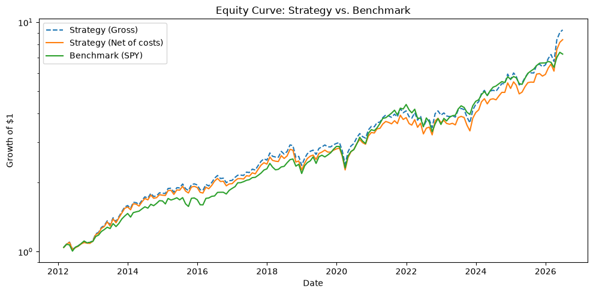

# Momentum & Value Strategy Backtester

A point-in-time, cost-aware backtester for factor strategies on the S&P 500, built to answer one
question honestly: **do textbook momentum and value tilts actually beat buy-and-hold once you
remove look-ahead bias, survivorship bias, and transaction costs?**

Built by [Alex Gard](mailto:arwgard@icloud.com), Mathematics undergraduate at the University of
Bristol. Every design decision in here is meant to be explainable, not just functional.

## Headline results

Long-only, equal-weight, top-50 portfolios drawn from the S&P 500 as it was constituted on each
rebalance date. 2012 to 2026, net of a 10 bps one-way transaction cost on turnover.

| | Momentum (12-1, monthly) | Value composite (quarterly) | 50/50 blend (quarterly)* | SPY buy & hold |
|---|---|---|---|---|
| CAGR (net) | 15.7% | 16.1% | 16.3% | 14.5% |
| Annualised volatility | 16.9% | 17.1% | 16.1% | 14.1% |
| Sharpe (net) | 0.96 | 0.94 | 1.00 | 1.05 |
| Max drawdown (net) | −19.7% | −33.8% | −26.4% | −23.9% |
| Cost drag on CAGR | 0.78%/yr | 0.22%/yr | | |

\* Blends are evaluated on a common quarterly window, so the pure sleeves in that sweep differ
slightly from the native-frequency columns. Full sweep in [REVIEW.md](REVIEW.md) §4.



**The honest reading.** Both factors beat SPY on raw return by 1 to 2 percentage points a year,
but neither beats it risk-adjusted in this window. 2012 to 2026 was a long, low-volatility bull
market, the easiest possible environment for buy-and-hold. A backtester that never produces an
awkward result would be suspicious.

The classic academic long-short momentum factor (long top 50, short bottom 50, dollar-neutral)
was **flat**: net CAGR +0.5%, Sharpe 0.12, max drawdown −56%, negative in 59% of rolling
three-year windows. That matches the post-2009 momentum-crash literature (Daniel & Moskowitz) and
is reported as found. The practical 130/30 structure did fine (CAGR 16.2%, Sharpe 0.91).

## What I learned

1. **My best-looking conclusion did not survive out-of-sample testing.** The full-sample tables
   said the 50/50 momentum/value blend was best. A walk-forward test (pick the best blend weight
   from the trailing 5 years, apply it to the next unseen year, roll 2017 to 2026) showed the
   chosen weight bouncing between 0% and 100% momentum, and adaptive weighting (Sharpe 0.78)
   underperforming every fixed weight (0.76 to 0.86). Out of sample, fixed 50/50 (0.85) is tied
   with pure momentum (0.85). The defensible claim is weaker: any fixed blend did fine, none was
   reliably best, and timing the blend made things worse.

2. **Point-in-time data is most of the work.** Historical index membership had to be
   reconstructed per rebalance date, and every SEC fundamental had to be gated on the date it
   was *filed*, not the period it covered. Restated quarters keep only the version visible at the
   time. Getting this wrong produces a strategy that quietly trades on information nobody had.

3. **Survivorship bias should be measured, not footnoted.** Around 13% of the historical universe
   has no price data at all (long-delisted names Yahoo no longer serves) and a further 2% has
   prices but no fundamentals. I measured the return tilt on the measurable slice: about +2%/yr in
   the value strategy's favour, with a t-statistic of 0.47, so indistinguishable from noise, but
   best read as a lower bound because mid-quarter delistings are dropped rather than booked.
   Crucially, SPY does not suffer this gap, which slightly flatters every strategy-vs-SPY
   comparison here. That is stated wherever the comparison appears.

4. **A flat cost model is fine if you know where it breaks.** Corwin-Schultz spread estimates on
   the cached data and a daily-volume capacity bound put the 10 bps assumption at
   realistic-to-conservative up to roughly $100M to $300M AUM. It is thinnest on the short book of
   the long-short strategy, where bottom-momentum names have the widest spreads and hard-to-borrow
   fees are understated. A per-stock impact model would have been false precision without proper
   quote data.

5. **Fixed textbook parameters are a real defence against overfitting, but not a complete one.**
   Nothing in the strategies (12-1 lookback, top 50, the value composite, rebalance cadence) was
   fitted to this data. The one thing that *was* fitted, the blend weight, is exactly the thing
   that failed out of sample.

## What's in it

| Phase | What it does | Notebook |
|---|---|---|
| 1 | Long-only 12-1 momentum, monthly rebalance, point-in-time S&P 500 membership, turnover-based costs | `01_momentum_backtest.ipynb` |
| 2 | Long-only value composite (P/B, P/E, EV/EBITDA, growth-adjusted) on a from-scratch, filed-date-gated SEC EDGAR fundamentals layer, quarterly rebalance | `02_value_backtest.ipynb` |
| 3 | Head-to-head comparison and fixed-weight blend sweep | `03_strategy_comparison.ipynb` |
| 4 | Long-short momentum at dollar-neutral and 130/30 exposures, per-book costing, sensitivity-tested borrow fee | `04_long_short_momentum.ipynb` |
| 5 | Bias audit: look-ahead re-verification, measured survivorship gap, cost realism, walk-forward test of the blend weight, robustness of the long-short result | `05_walk_forward_and_robustness.ipynb` |

The two audit documents are the detailed record:

- [REVIEW.md](REVIEW.md): the Phase 3 review. Three bugs found and fixed (one-sided cost
  charging, a misaligned benchmark window, non-reproducible results) and the comparison tables.
- [REVIEW_PHASE5.md](REVIEW_PHASE5.md): the Phase 5 audit. Walk-forward results, survivorship
  measurement, cost stress test, long-short robustness, with the provenance of every number.

## Bias controls

- **Universe:** S&P 500 membership reconstructed as of each rebalance date, so names are held only
  while they were actually in the index. No current-constituent lists.
- **Prices:** signals use only prices available at the formation date. Names missing a required
  price are excluded before ranking, never ranked as "low".
- **Fundamentals:** every figure is filtered on `filed <= as_of_date`. Restatements use only the
  version filed by then.
- **Returns:** booked at the next rebalance date. The benchmark window is aligned to the
  strategy's first realised return (a regression test guards this).
- **Costs:** two-sided turnover-based cost on every rebalance; separate borrow fee on the short
  book.
- **Reproducibility:** identical results run-to-run on the same cache. 106 offline tests.

## Known limitations

- Delisted names that Yahoo Finance no longer serves are invisible to every strategy. The
  measurable part of this gap is quantified above; the unmeasurable part is disclosed.
- A stock that delists mid-holding-period is dropped from that period's average rather than
  booked as a loss. Both engines report the count (0 across the full runs, so currently moot).
- The cost model is flat. Realistic at small scale, not at institutional scale.
- Blend rebalancing between sleeves is not separately costed (about 1 bp per quarter).
- Universe is the S&P 500 only, which is a large-cap, liquid index by construction. The findings
  should not be assumed to transfer to small caps.

## How to run it

```
python -m venv .venv
.venv\Scripts\activate          # Windows (source .venv/bin/activate on Mac/Linux)
pip install -r requirements.txt
python -m pytest tests/         # offline, all green
jupyter notebook notebooks/     # run 01 to 05 in order
```

The first run of each notebook downloads and caches prices (yfinance) and fundamentals (SEC
EDGAR) under `data/cache/`. Slow once, fast after. The cache is gitignored. Both audit scripts run
offline against it:

```
python scripts/coverage_gap_analysis.py    # survivorship measurement (REVIEW_PHASE5 §4)
python scripts/cost_realism_analysis.py    # spread and capacity estimate (REVIEW_PHASE5 §5)
```

## Repository layout

```
src/
  config.py            one place for every parameter: windows, sizes, dates, costs
  data_layer/          prices, point-in-time constituents, SEC EDGAR fundamentals, cache, quality checks
  strategy/            momentum and value signal construction
  backtest/            long-only engine, value engine, long-short engine
  costs/               turnover-based transaction cost model
  evaluation/          metrics, comparison and blends, walk-forward, plots
tests/                 106 offline tests with hand-computable synthetic cases
scripts/               the two reproducible audit scripts
notebooks/             phases 1 to 5, in order
```

## Design principles

- **Swappable data layer.** Strategy logic never talks to a vendor directly, so yfinance can be
  replaced without touching signal or backtest code.
- **Config-driven.** Lookbacks, portfolio size, dates and costs live in `src/config.py`, not
  scattered across modules.
- **Honest numbers over flattering ones.** No pass/fail verdicts, every number has a provenance,
  and awkward results are reported as found.

## Development history

Built iteratively with Claude Code assistance. Each step is a separate commit describing what
changed and why, so the project's evolution is recoverable. The bar I set for myself was being
able to open any file cold in an interview and explain every decision in it.

## What's next

This repo is complete as a study. Its successor, [quantlab](https://github.com/Rossod4/quantlab),
is a general research platform that ports these strategies onto a point-in-time data context where
look-ahead is structurally impossible, and adds a validation report card (deflated Sharpe, purged
cross-validation, White's reality check, Monte Carlo, capacity) that gates any strategy before it
can be paper traded.
